# Franka MoveIt Calibration

This repo helps you calibrate RealSense cameras with a Franka Research 3 robot and MoveIt Calibration.

| Robot Setup                                     | After Calibration                                            |
| ----------------------------------------------- | ------------------------------------------------------------ |
| 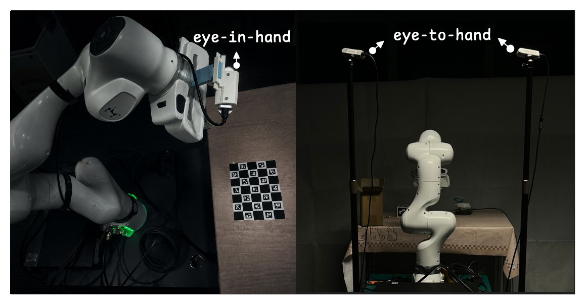 | 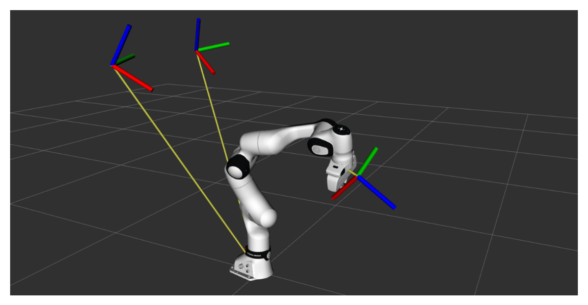                      |
| A wrist RealSense camera is mounted on the Franka hand for eye-in-hand calibration. Two fixed RealSense cameras observe the workspace for eye-to-hand calibration. | The eye-in-hand camera is calibrated relative to the flange frame. The eye-to-hand cameras are calibrated relative to the robot base frame. |

No Docker and no complicated setup. Run one command to prepare your environment:

```shell
pixi install
```

Then you can use MoveIt Calibration with a Franka Research 3 robot in either layout:

- [eye-to-hand](#61-choose-eye-in-hand-or-eye-to-hand) or
- [eye-in-hand](#61-choose-eye-in-hand-or-eye-to-hand)

# 0: Compatibility

This `humble` branch pins the Franka stack to:

| franka_ros2 Version | libfranka Version | franka_description Version |
| ------------------- | ----------------- | -------------------------- |
| 2.2.0               | 0.19.0            | 1.3.0                      |

# 1: Prepare Materials

> [!NOTE]
>
> If your lab already has a [ChArUco board](https://calib.io/products/charuco-targets?variant=9400454807599), feel free to skip to [2: Prerequisites](#2-prerequisites).

## 1.1 ChArUco

Print the [ChArUco target](./assets/Charuco_20cm_length.pdf) on A4 paper.

## 1.2 ChArUco Board

Use a 3D printer to print a [board](./assets/charuco_board.stp), then attach the ChArUco paper to it.

- If you only want to do an eye-in-hand calibration, you can skip to [1.3 Measurement](#13-measurement).
- If you do not have a 3D printer, use a rigid plate. Attach the printed ChArUco target to it and leave enough room for the robot to grasp it.

<p align="center">
  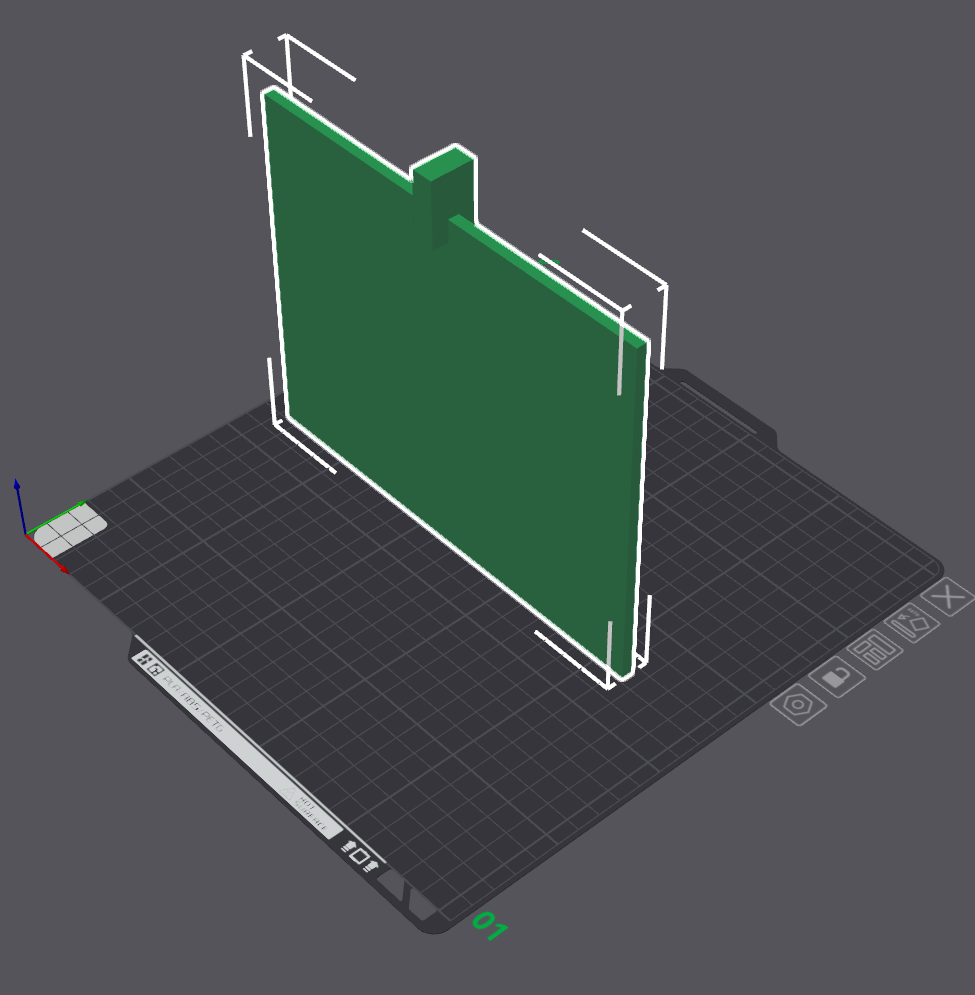
</p>

## 1.3 Measurement

After cutting the A4 paper, measure "longest board side" and "measured marker size" in meters.

<p align="center">
  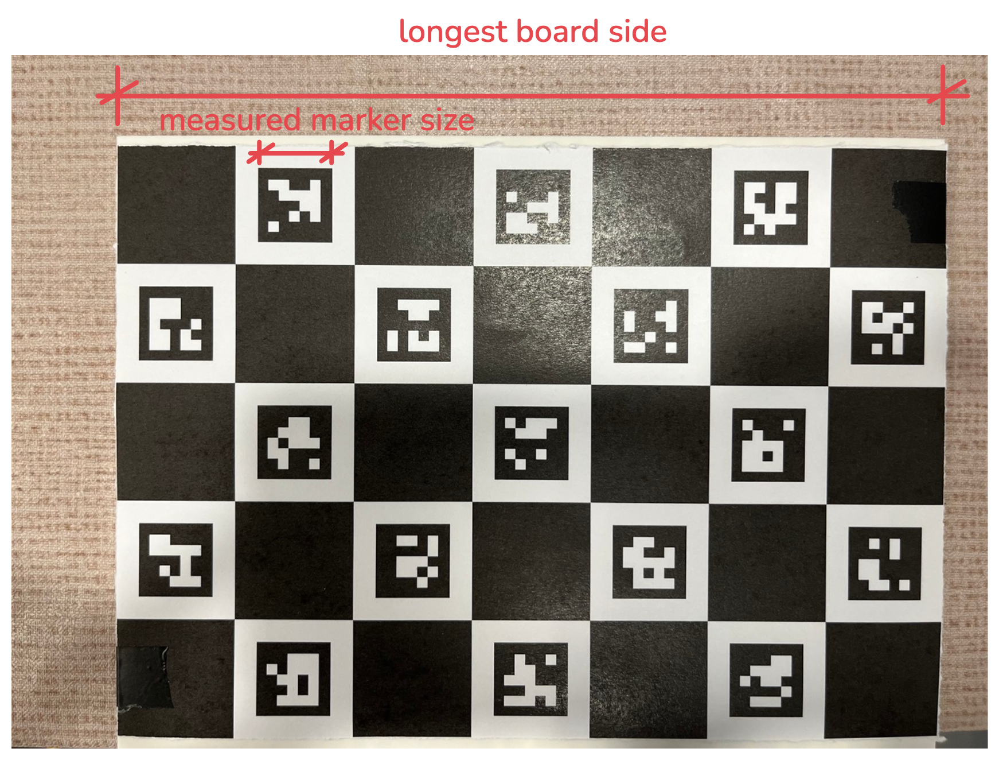
</p>

After measurement, continue to [2: Prerequisites](#2-prerequisites).

# 2: Prerequisites

Before you continue, make sure you have:

- at least one machine with a real-time kernel: see [here](https://frankarobotics.github.io/docs/doc/libfranka/docs/real_time_kernel.html).
- `udev` rules for RealSense cameras: see [here](https://github.com/realsenseai/librealsense/blob/master/doc/installation.md#install-librealsense2).

Clone this repo:

```shell
git clone https://github.com/XingxinHE/franka_moveit_camera_calibration.git -b humble
```

Install [pixi](https://pixi.prefix.dev/latest/installation/):

```shell
curl -fsSL https://pixi.sh/install.sh | sh
```

# 3: Choose Your Setup

## 3.1 RealSense and Franka Control on One Machine

By default, this repo assumes that the cameras are connected to the same workstation that controls the Franka robot.

<p align="center">
  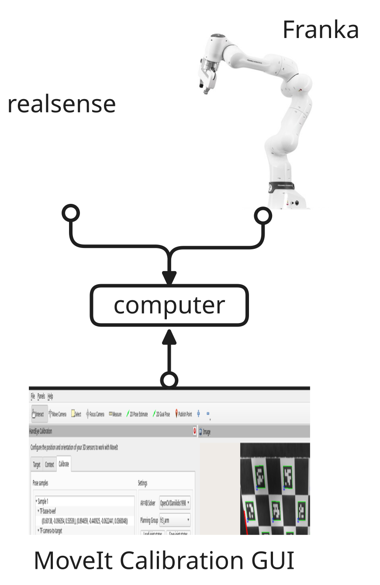
</p>

If this matches your setup, continue to [4: Launch the Cameras](#4-launch-the-cameras).

## 3.2 RealSense and Franka Control on Different Machines

Use this setup if your RealSense cameras are connected to computer A and the real-time kernel PC is computer B, or the other way around.

<p align="center">
  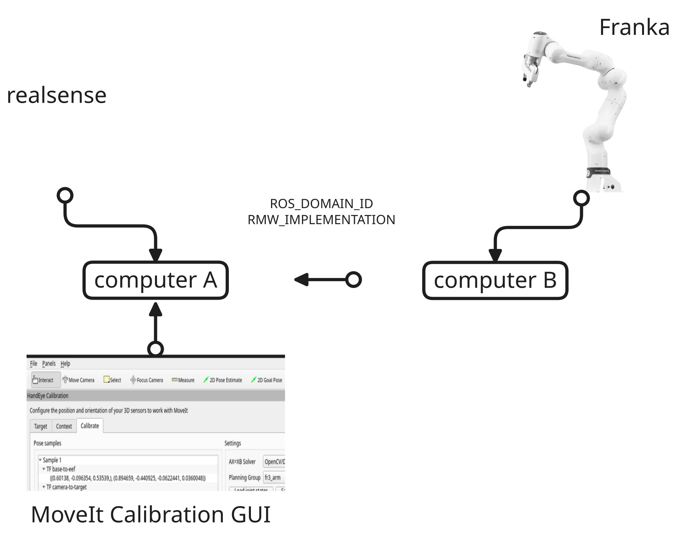
</p>

Follow these steps.

(1) Clone this repo on both computer A and computer B:

```shell
git clone https://github.com/XingxinHE/franka_moveit_camera_calibration.git -b humble
```

(2) Use the same settings on all computers in [`pixi.toml`](./pixi.toml).

```toml
[activation.env]
ROS_DOMAIN_ID = "123"
RMW_IMPLEMENTATION = "rmw_cyclonedds_cpp"    # or use rmw_zenoh_cpp
```


> [!CAUTION]
> There are two `[activation.env]` in the [`pixi.toml`](./pixi.toml). One is for the robot environment and the other is for the realsense environment. Make sure they are aligned.


<details>
<summary><strong>Using <code>rmw_zenoh_cpp</code> across two machines</strong></summary>
If DDS discovery is unreliable across the two machines, use `rmw_zenoh_cpp` instead.
Set the same ROS domain and Zenoh configuration on both computer A and computer B:

```toml
[activation.env]
ROS_DOMAIN_ID = "123"
RMW_IMPLEMENTATION = "rmw_zenoh_cpp"
ZENOH_SESSION_CONFIG_URI = "./zenoh_client.json5"
```

Decide which computer acts as the router. Start the Zenoh router on that computer:

```shell
pixi run ros2 run rmw_zenoh_cpp rmw_zenohd
```

<p align="center">
  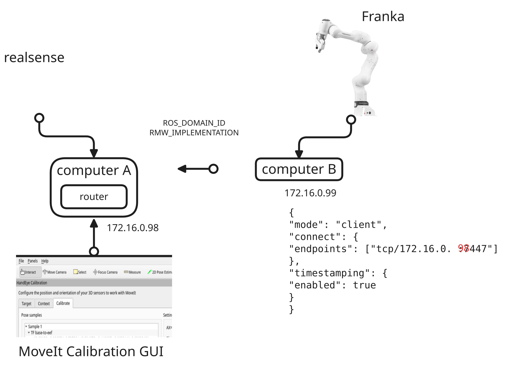
</p>

Then edit [`zenoh_client.json5`](./zenoh_client.json5) and replace the endpoint IP with the IP address of the machine running the Zenoh router:

```json5
{
  "mode": "client",
  "connect": {
    "endpoints": ["tcp/<ZENOH_ROUTER_IP>:7447"]
  },
  "timestamping": {
    "enabled": true
  }
}
```

For example, if the Zenoh router runs on `172.16.0.98`, keep:

```json5
"endpoints": ["tcp/172.16.0.98:7447"]
```

> [!NOTE]
> Make sure both machines can reach this IP and port `7447` before launching the cameras and Franka control nodes.

</details>

When the multi-machine ROS network is ready, continue to [4: Launch the Cameras](#4-launch-the-cameras).

# 4: Launch the Cameras

## 4.1 Set Camera Serial Numbers

To launch your cameras, update the serial numbers in the files below.

> [!NOTE]
> You can rename `robot0_agentview_left`, `robot0_agentview_right`, or `robot0_eye_in_hand` if you want different camera names.

(1) If you have multiple cameras, change the serial numbers in this [script](scripts/launch_multiple_cameras.sh).

```bash
launch_camera "robot0_agentview_left" "342522074350" "false"
wait_for_topic "/robot0_agentview_left/color/image_raw" 30

launch_camera "robot0_agentview_right" "347622071856" "false"
wait_for_topic "/robot0_agentview_right/color/image_raw" 30

launch_camera "robot0_eye_in_hand" "336222070633" "false"
wait_for_topic "/robot0_eye_in_hand/color/image_raw" 30
```

(2) If you only have one camera, change the serial number in this line of [`pixi.toml`](pixi.toml).

```toml
launch-one-camera = "ros2 launch realsense2_camera rs_launch.py camera_namespace:=/ camera_name:=robot0_eye_in_hand serial_no:=_405622074798 initial_reset:=false enable_depth:=false rgb_camera.color_profile:=640x480x30"
```

## 4.2 Start the Camera Streams

Run this on the machine where the RealSense cameras are plugged in.

Option 1: run multiple cameras:

```shell
pixi run -e realsense launch-multiple-cameras
```

Option 2: launch only one camera:

```shell
pixi run -e realsense launch-one-camera
```

## 4.3 Visualize the Stream

Run:

```shell
pixi run ros2 run rqt_gui rqt_gui
```

To view an image topic, open `Plugins` > `Visualization` > `Image`. Then choose the topic name you set in the last section from the drop-down list.

<p align="center">
  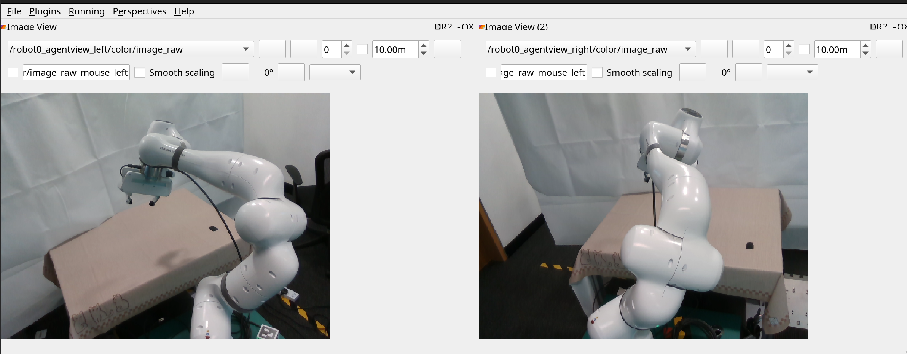
</p>

Keep this terminal **open**.

> [!NOTE]
> You can also check the camera info from your terminal.
>
> ```shell
> pixi run ros2 topic echo --once /robot0_agentview_left/color/camera_info
> pixi run ros2 topic echo --once /robot0_agentview_right/color/camera_info
> pixi run ros2 topic echo --once /robot0_eye_in_hand/color/camera_info
> ```

> [!IMPORTANT]
> If the cameras run on another machine, both machines must use the same `ROS_DOMAIN_ID` and `RMW_IMPLEMENTATION` from `pixi.toml`.

When the camera stream is visible, continue to [5: Launch the Robot](#5-launch-the-robot).

# 5: Launch the Robot
> [!IMPORTANT]
> Before you continue, make sure your robot is unlocked and FCI is enabled.

Run this on the real-time kernel computer connected to the FR3:

```shell
pixi run fr3-calib-launch robot_ip:=172.16.0.55
```

Keep this terminal **open**. It launches the robot driver, MoveIt, RViz, controllers, and gripper.

<p align="center">
  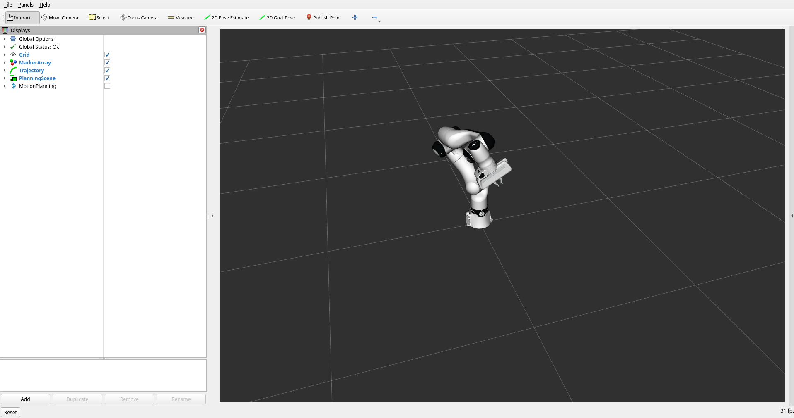
</p>

---

<details>
<summary>(optional) Check the Franka robot</summary>

(1) Check the controllers before moving ahead:

```shell
pixi run ros2 control list_controllers -c /controller_manager
```

The expected values are:

```
franka_robot_state_broadcaster franka_robot_state_broadcaster/FrankaRobotStateBroadcaster  active
fr3_arm_controller             joint_trajectory_controller/JointTrajectoryController       active
joint_state_broadcaster        joint_state_broadcaster/JointStateBroadcaster               active
```

(2) Check the actions before moving ahead:

```shell
pixi run ros2 action list -t
```

The expected values are:

```
/action_server/error_recovery [franka_msgs/action/ErrorRecovery]
/action_server/ptp_motion [franka_msgs/action/PTPMotion]
/execute_trajectory [moveit_msgs/action/ExecuteTrajectory]
/fr3_arm_controller/follow_joint_trajectory [control_msgs/action/FollowJointTrajectory]
/fr3_gripper/gripper_action [control_msgs/action/GripperCommand]
/franka_gripper/grasp [franka_msgs/action/Grasp]
/franka_gripper/gripper_action [control_msgs/action/GripperCommand]
/franka_gripper/homing [franka_msgs/action/Homing]
/franka_gripper/move [franka_msgs/action/Move]
/move_action [moveit_msgs/action/MoveGroup]
```

</details>

When RViz and the robot controllers are ready, continue to [6: Prepare Calibration Setup](#6-prepare-calibration-setup).

# 6: Prepare Calibration Setup

## 6.1 Choose Eye-in-Hand or Eye-to-Hand

| Eye-in-Hand                                                  | Eye-to-Hand                                                  |
| ------------------------------------------------------------ | ------------------------------------------------------------ |
| 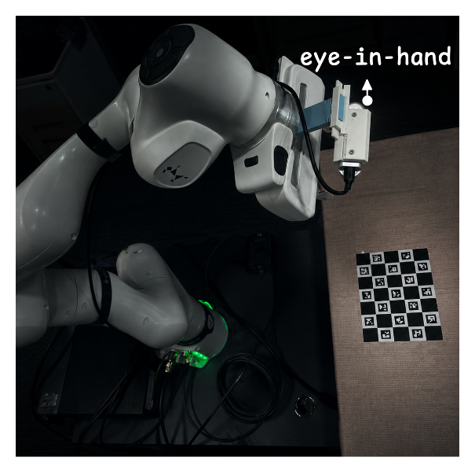                            | 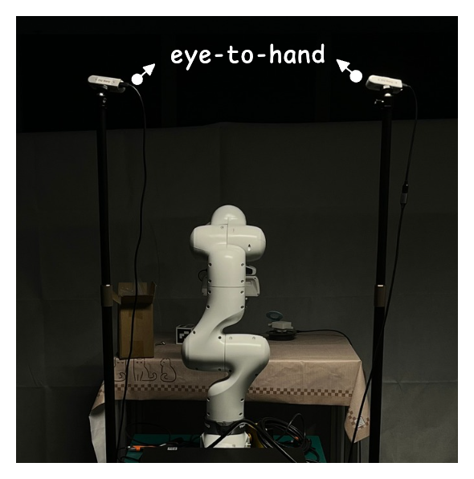                            |
| Use this for the wrist camera. The ChArUco board must stay fixed in the world for all samples. | Use this for fixed cameras near the robot base. The ChArUco board must move rigidly with the robot hand. |
|                                                              |                                                              |

After choosing the calibration layout, continue to [6.2 Place the ChArUco Target](#62-place-the-charuco-target).

## 6.2 Place the ChArUco Target

| Eye-in-Hand                                                  | Eye-to-Hand                                             |
| ------------------------------------------------------------ | ------------------------------------------------------- |
| 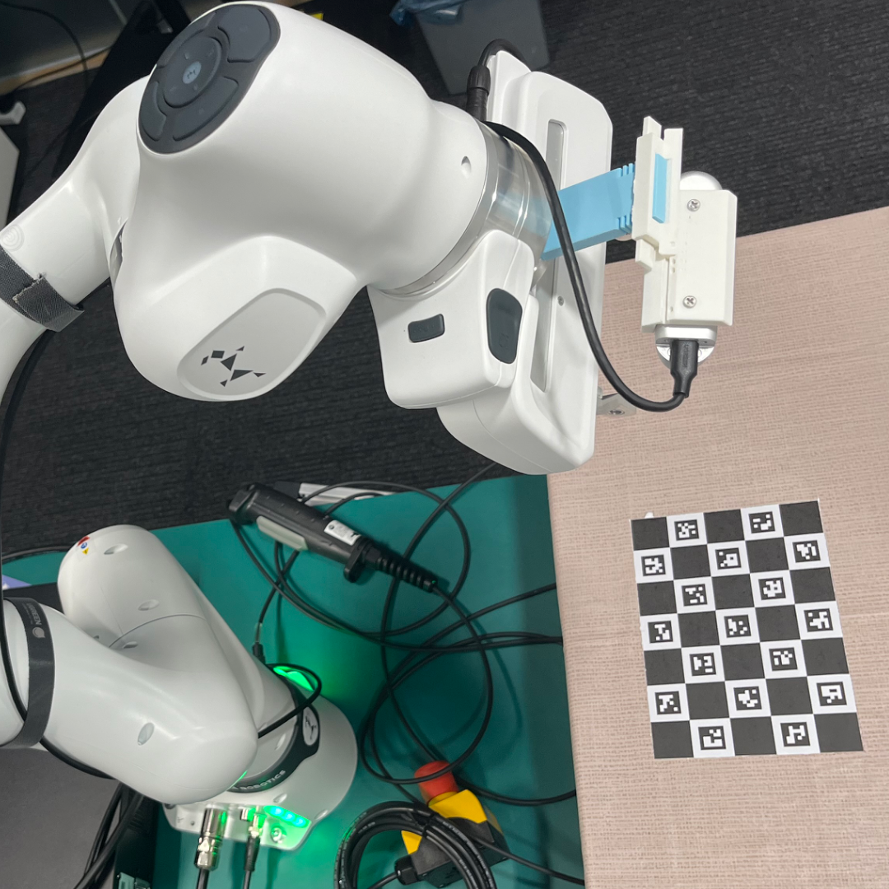                     | 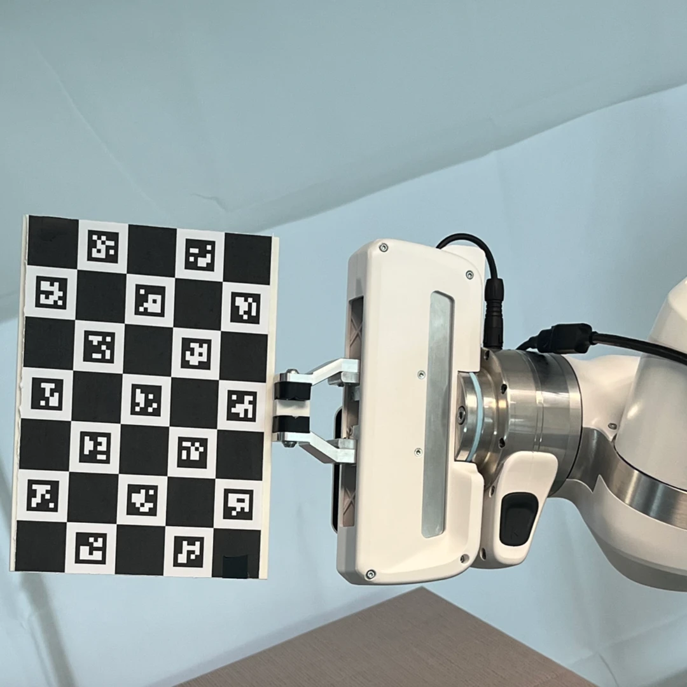                 |
| Place the ChArUco board on a table or static wall. | Grasp the ChArUco board with the Franka Hand. |
|                                                              |                                                         |

After placing the target, continue to [6.3 Open and Configure HandEyeCalibration](#63-open-and-configure-handeyecalibration).

## 6.3 Open and Configure HandEyeCalibration

### 6.3.1 Open the HandEyeCalibration Panel

In RViz, under the `Display` panel, click `Add`. In the dialog, add the `HandEyeCalibration` plugin.

<p align="center">
  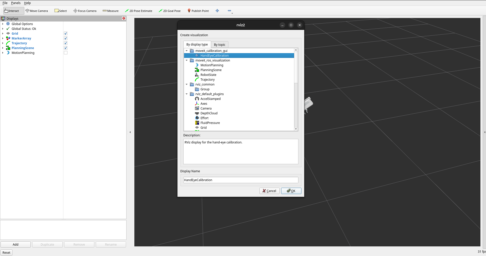
</p>

### 6.3.2 Configure ChArUco Detection

When the `HandEye Calibration` tab appears, set the following values.

| Parameter                | Value                             |
| :----------------------- | :-------------------------------- |
| Target Type              | `HandEyeTarget/Charuco`           |
| squares, X               | `5`                               |
| squares, Y               | `7`                               |
| marker size (px)         | `50`                              |
| square size (px)         | `80`                              |
| margin size (px)         | `2`                               |
| marker border (bits)     | `1`                               |
| ArUco dictionary         | `DICT_5X5_250`                    |
| longest board side (m)   | `0.1995`                          |
| measured marker size (m) | `0.0178`                          |
| Camera Image Topic       | `<topic_of_camera_you_calibrate>` |

in this tab:

<p align="center">
  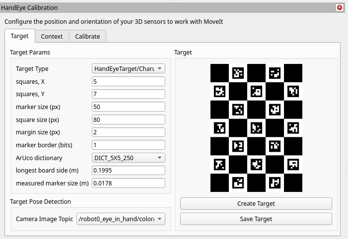
</p>

> [!IMPORTANT]
> For "longest board side" and "measured marker size", make sure the values match the measurements you took in [1.3 Measurement](#13-measurement).

When the target parameters are set, choose one robot-control method: [7.1.1 MoveIt Motion Planning](#711-option-a-moveit-motion-planning) or [7.1.2 Gravity Compensation](#712-option-b-gravity-compensation).

# 7: Position the Robot and Check Detection

## 7.1 Position the Robot for Target Visibility

You now have two options for moving the robot so that the camera can see the ChArUco board.

Choose only one option. Use [MoveIt Motion Planning](#711-option-a-moveit-motion-planning) for the normal workflow, or [Gravity Compensation](#712-option-b-gravity-compensation) if you want to physically guide the robot.

### 7.1.1 Option A: MoveIt Motion Planning

In the `Display` panel, click the `Add` button. This opens the motion planning GUI.

<p align="center">
  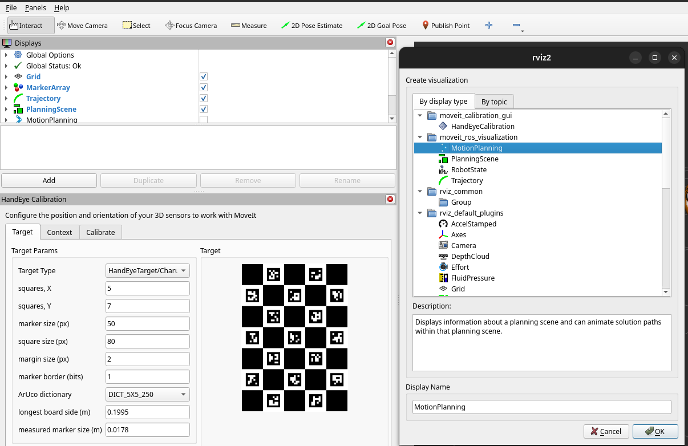
</p>

After opening the tab, drag the gizmo to translate or rotate the target pose. The orange Franka shows the desired pose. Click `Plan` to preview the motion. If the plan looks good, click `Execute` to move the robot.

<p align="center">
  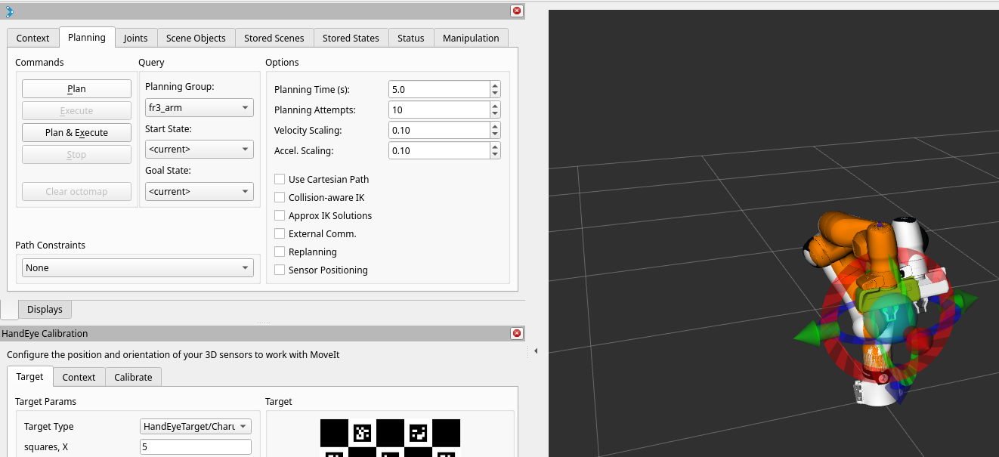
</p>

If you use this option, vary both translation and rotation between samples. Continue to [7.2 Confirm ChArUco Detection](#72-confirm-charuco-detection).

### 7.1.2 Option B: Gravity Compensation

The other option is the gravity compensation controller, which lets you physically guide the robot.

<p align="center">
  <a href="./assets/gravity-kinesthetic-franka-moveit-calibration.mp4">
    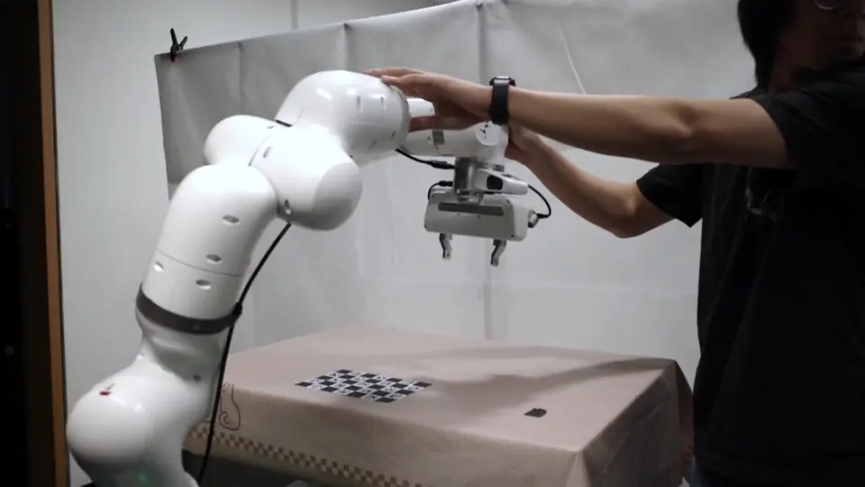
  </a>
</p>

> [!NOTE]
> I recommend this method only for advanced Franka Research 3 users, because the payload model must be estimated manually.

> [!CAUTION]
> If the payload value is wrong, the arm may drift or drop while gravity compensation is active. Be careful and ask another person to help.

---

#### 7.1.2.1 Adjust the Payload Model

Measure the weights of:

1. the wrist RealSense camera
2. the camera mount on the end effector
3. the ChArUco board, if you use eye-to-hand calibration

Measure the position of each center of mass with respect to the Franka Hand TCP frame:

1. the wrist RealSense camera
2. the camera mount on the end effector
3. the ChArUco board, if you use eye-to-hand calibration

> [!TIP]
> The Franka Hand TCP frame is shown below:
>
> <p align="center">
>   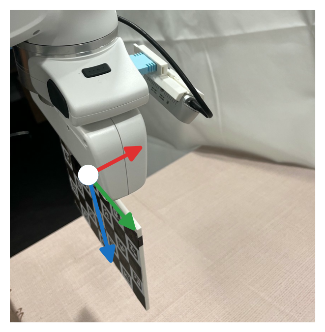
> </p>
>
> Use the axis signs from this TCP frame. For example, if the camera center of mass is forward and above the TCP as shown in the sketch, its position can have signs like $x^+, y^+, z^-$.
>
> In vector form, enter this as ${}^{TCP}\mathbf{p}_{COM} = [x, y, z]^T$ in meters.

Once you have these values, enter them in [scripts/payload_com.py](./scripts/payload_com.py).

```python
PARTS = [
    # name, mass_kg, [x_tcp_m, y_tcp_m, z_tcp_m]
    ("realsense_d435i", 0.072, [0.05, -0.1, -0.08]),
    ("charuco_board", 0.095, [0.00, 0.00, 0.15]),
    ("camera_mount", 0.030, [0.025, -0.03, -0.07]),
]
```

Then run:

```shell
pixi run python scripts/payload_com.py
```

---

Run the following 3 commands to override the defaults if you measured a better combined payload model:

```bash
pixi run arm-off

PAYLOAD_MASS=0.197 PAYLOAD_CX=-0.01346 PAYLOAD_CY=-0.044688 PAYLOAD_CZ=0.135837 \
PAYLOAD_IXX=0.0002 PAYLOAD_IYY=0.0002 PAYLOAD_IZZ=0.0002 \
pixi run payload-set-calib-kit

pixi run arm-on
```

`payload-set-calib-kit` is not automatic. It makes one `SetLoad` service call to `/service_server/set_load`, which updates the robot-side external-load model. Check the currently reported external load with:

```bash
pixi run payload-state
```

> [!TIP]
> If the calibration kit is removed, explicitly reset the external load:
>
> ```bash
> pixi run arm-off
> pixi run payload-reset
> pixi run arm-on
> pixi run payload-state
> ```

#### 7.1.2.2 Sample with Gravity Compensation

After you adjust the payload, you can load the gravity compensation controller once:

```bash
pixi run gravity-load
```

Switch into gravity compensation only when you are ready to physically guide the robot:

```bash
pixi run gravity-on
```

> [!NOTE]
>
> Do not use MoveIt `Plan` or `Execute` while gravity compensation is active. Take samples by physically moving the robot, waiting for stable target detection, and clicking `Take sample`.

> [!TIP]
> If you want to switch back to 7.1.1 MoveIt motion planning, run:
>
> ```shell
> pixi run gravity-off
> ```

When the target is visible, continue to [7.2 Confirm ChArUco Detection](#72-confirm-charuco-detection).

## 7.2 Confirm ChArUco Detection

Once your camera can see the ChArUco board with either motion planning or gravity compensation, go to `Display` panel > `Add` > `By topic` > `/handeye_calibration` > `target_detection` > `Image`.

<p align="center">
  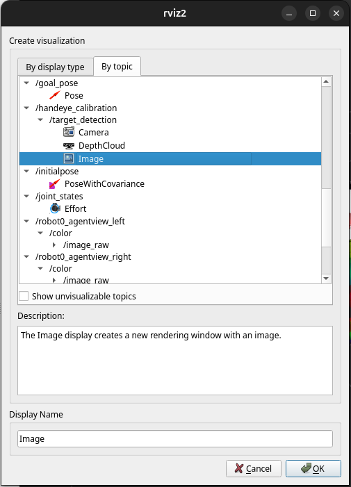
</p>

You should see the detected ChArUco board.

| Eye-in-Hand                                    | Eye-to-Hand                                    |
| ---------------------------------------------- | ---------------------------------------------- |
| 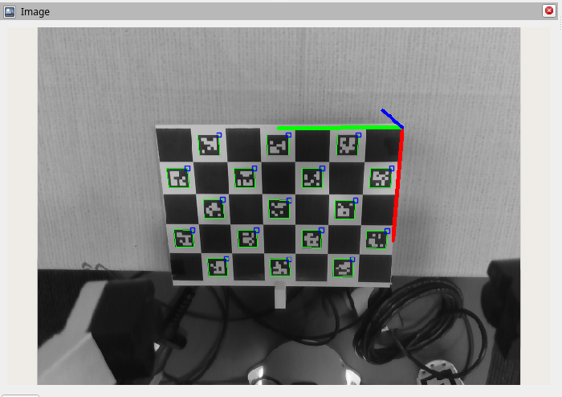 | 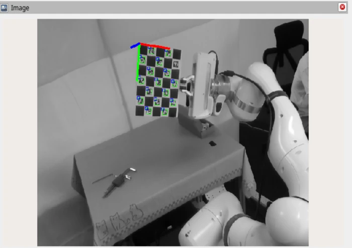 |
|                                                |                                                |

When detection is stable, continue to [8.1 Configure Hand-Eye Frames](#81-configure-hand-eye-frames).

# 8: Solve Hand-Eye Calibration

## 8.1 Configure Hand-Eye Frames

Return to the `HandEye Calibration` panel and set these values:

| Parameter            | Eye-in-hand               | Eye-to-hand               |
| :------------------- | :------------------------ | :------------------------ |
| Sensor configuration | Eye-in-hand               | Eye-to-hand               |
| Sensor frame         | `<your camera name>_link` | `<your camera name>_link` |
| Object frame         | `handeye_target`          | `handeye_target`          |
| End-effector frame   | `fr3_link8`               | `fr3_link8`               |
| Robot base frame     | `fr3_link0`               | `fr3_link0`               |

in this tab:

<p align="center">
  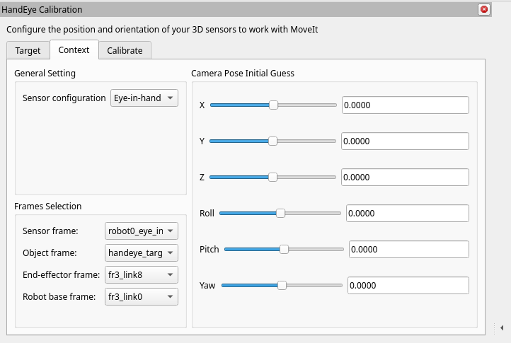
</p>

> [!IMPORTANT]
> In the official MoveIt Calibration tutorial, the "sensor frame" is usually set to the optical frame. This guide uses the sensor `*_link` frame. Why?
>
> `*_link` is the default base frame published by [`realsense2_camera/launch/rs_launch.py`](https://github.com/realsenseai/realsense-ros/blob/6d87b071dcfef15f2a0407e1e78945256add70d0/realsense2_camera/launch/rs_launch.py#L93). See https://github.com/realsenseai/realsense-ros#parameters for more details.
>
> The transform chain `*_link -> *_color_frame -> *_color_optical_frame` is defined in [`realsense2_description/urdf/_d435.urdf.xacro`](https://raw.githubusercontent.com/realsenseai/realsense-ros/refs/heads/ros2-master/realsense2_description/urdf/_d435.urdf.xacro).
>
> For this workflow, use `*_link` instead of `*_optical_frame`. For sim-to-real alignment, you usually need `fr3_link0 -> *_optical_frame`; that transform will be available after calibration through the RealSense TF chain.

> [!TIP]
> TL;DR: use something like `robot0_eye_in_hand_link` rather than `robot0_eye_in_hand_optical_frame`.

After setting the frames, continue to [8.2 Collect and Solve Samples](#82-collect-and-solve-samples).

## 8.2 Collect and Solve Samples

Now collect samples to estimate the camera extrinsic transform.

This README uses Craig-style notation: ${}^{A}T_{B}$ is the pose of frame $\{B\}$ expressed in frame $\{A\}$. It maps coordinates from frame $\{B\}$ to frame $\{A\}$. In Tedrake/Drake notation, this is $X_{AB}$.

- Use `OpenCV/Tsai1989` as the first solver. Compare `OpenCV/Daniilidis1998` or `OpenCV/Park1994` if the result looks suspicious.
- Use planning group `fr3_arm`.

<p align="center">
  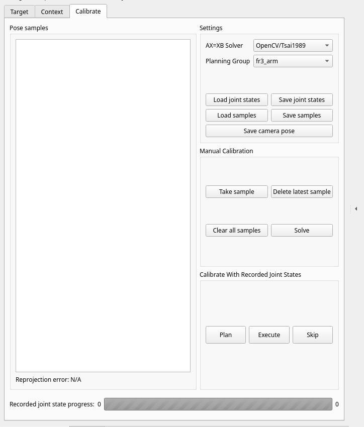
</p>

1. Move the robot so the camera sees the ChArUco board from 10-15 poses. Vary the rotation around **at least two axes**.
2. Click `Take sample` only when the green target detection is stable.
3. After collecting 15 or more samples, click `Solve`. Compare solvers if needed, then click `Save camera pose` and save the result to one of these launch files:
   1. `data/eye-in-hand/eye-in-hand.launch.py`
   2. `data/eye-to-hand-left/eye-to-hand-left.launch.py`
   3. `data/eye-to-hand-right/eye-to-hand-right.launch.py`

> [!TIP]
> If you use the same setup as [DROID](https://droid-dataset.github.io/droid/), with one wrist camera and two third-person cameras, you can probably reuse my provided trajectory. Click `Load joint states`, load `joint-states.yaml` from the [data](./data) folder, then repeat `Plan` > `Execute` > `Take Sample`.

After saving the launch file, continue to [9.1 Add the TF Display](#91-add-the-tf-display), then jump to [9.2 Verify Eye-in-Hand Calibration](#92-verify-eye-in-hand-calibration) or [9.3 Verify Eye-to-Hand Calibration](#93-verify-eye-to-hand-calibration).

# 9: Verify Saved Calibration

## 9.1 Add the TF Display

Use the `TF` display to verify the saved transform. In RViz, open `Display` > `Add` > `TF`.

<p align="center">
  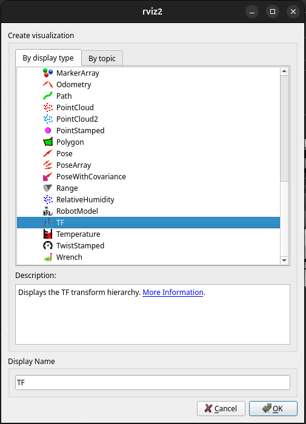
</p>

Click `OK` to add the display.

> [!NOTE]
> Because MoveIt Calibration uses OpenCV, the calibrated optical frame should follow the OpenCV camera convention: $z^+$ points forward, $x^+$ points right, and $y^+$ points down.
>
> <p align="center">
>   
> </p>

> [!NOTE]
> In RViz, `Fixed Frame` is the frame in which the TF display is expressed. For example, if `Fixed Frame` is `fr3_link8`, the displayed poses are expressed in the flange frame.

Then verify the result for your setup: [9.2 Eye-in-Hand](#92-verify-eye-in-hand-calibration) or [9.3 Eye-to-Hand](#93-verify-eye-to-hand-calibration).

## 9.2 Verify Eye-in-Hand Calibration

Open a new terminal. Launch the file you saved in the preceding section:

```shell
pixi run ros2 launch data/eye-in-hand/eye-in-hand.launch.py
```

Keep it running.

Change the `Fixed Frame` from `fr3_link0` to `fr3_link8`.

<p align="center">
  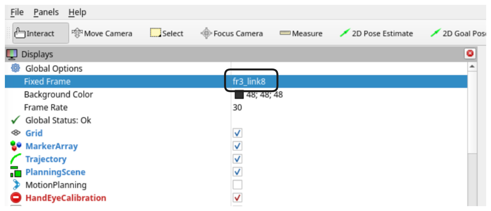
</p>


Now the TF display is expressed in the flange frame.

<p align="center">
  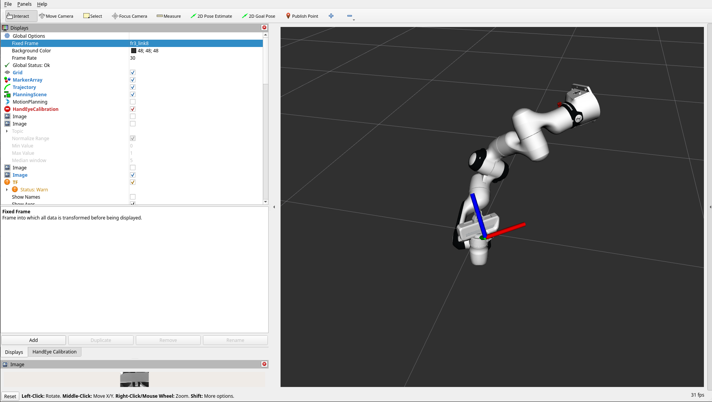
</p>

Inspect the `*_color_optical_frame` in the TF tree from the `Display` panel. The saved TF should contain:

```text
fr3_link8 -> robot0_eye_in_hand_color_optical_frame
```

<p align="center">
  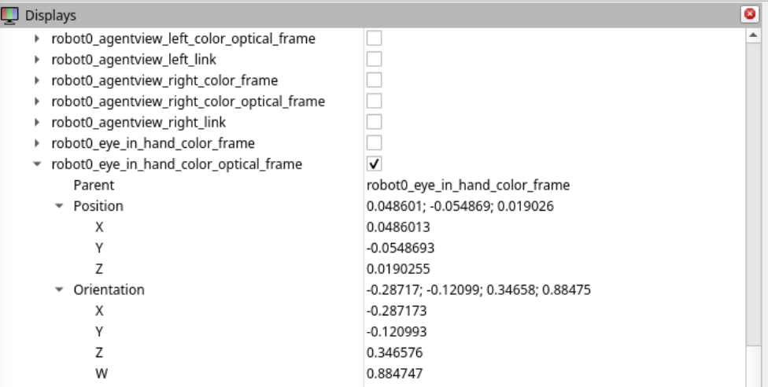
</p>

Let $\Set{F}$ be the flange frame (`fr3_link8`) and $\Set{C}$ be the camera optical frame. The saved camera pose is:

$$
{}^{F}T_{C}.
$$


Its translation and quaternion `(xyzw)` are:

$$
{}^{F}\mathbf{p}_{C} = \begin{bmatrix} 0.048601 \\\\ -0.054869 \\\\ 0.019026 \end{bmatrix}, \quad
{}^{F}\mathbf{q}_{C} = \begin{bmatrix} -0.287173 \\\\ -0.120993 \\\\ 0.346576 \\\\ 0.884747 \end{bmatrix}
$$

You can also verify the TF from a new terminal:

```bash
pixi run ros2 run tf2_ros tf2_echo fr3_link8 robot0_eye_in_hand_color_optical_frame
```

You should see a transform like this:

```
At time 0.0
- Translation: [0.049, -0.055, 0.019]
- Rotation: in Quaternion (xyzw) [-0.287, -0.121, 0.347, 0.885]
- Rotation: in RPY (radian) [-0.634, -0.015, 0.752]
- Rotation: in RPY (degree) [-36.305, -0.862, 43.065]
- Matrix:
  0.730 -0.544 -0.413  0.049
  0.683  0.595  0.424 -0.055
  0.015 -0.592  0.806  0.019
  0.000  0.000  0.000  1.000
```

## 9.3 Verify Eye-to-Hand Calibration

Open a new terminal. Launch the file you saved in the preceding section:

```shell
# verify the left third-person view
pixi run ros2 launch data/eye-to-hand-left/eye-to-hand-left.launch.py

# verify the right third-person view
pixi run ros2 launch data/eye-to-hand-right/eye-to-hand-right.launch.py
```

Keep it running.

Make sure the `Fixed Frame` at the top of the `Display` panel is `fr3_link0`, the robot base frame.

<p align="center">
  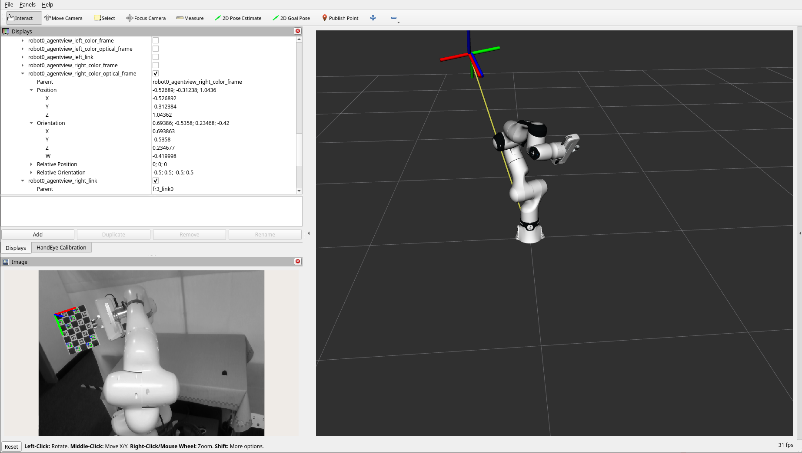
</p>

> [!TIP]
> The thin yellow line indicates that this frame is displayed relative to the robot base frame (`fr3_link0`).

Inspect the `*_color_optical_frame` in the TF tree. The saved TF should contain:

```text
fr3_link0 -> robot0_agentview_left_color_optical_frame
```

<p align="center">
  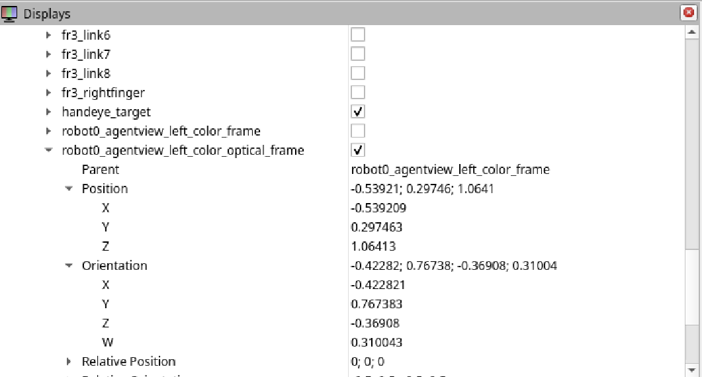
</p>

Let $\Set{B}$ be the robot base frame (`fr3_link0`) and $\Set{C}$ be the camera optical frame. The saved camera pose is:

$$
{}^{B}T_{C}
$$

Its translation and quaternion `(xyzw)` are:

$$
{}^{B}\mathbf{p}_{C} = \begin{bmatrix} -0.539 \\\\ 0.297 \\\\ 1.064 \end{bmatrix}, \quad
{}^{B}\mathbf{q}_{C} = \begin{bmatrix} -0.422 \\\\ 0.767 \\\\ -0.369 \\\\ 0.310 \end{bmatrix}
$$

You can also verify the TF from a new terminal:

```bash
pixi run ros2 run tf2_ros tf2_echo fr3_link0 robot0_agentview_left_color_optical_frame
```

You should see a transform like this:

```
At time 0.0
- Translation: [-0.539, 0.297, 1.064]
- Rotation: in Quaternion (xyzw) [-0.423, 0.767, -0.369, 0.310]
- Rotation: in RPY (radian) [-2.144, 0.164, -2.045]
- Rotation: in RPY (degree) [-122.863, 9.424, -117.152]
- Matrix:
 -0.450 -0.420  0.788 -0.539
 -0.878  0.370 -0.304  0.297
 -0.164 -0.829 -0.535  1.064
  0.000  0.000  0.000  1.000
```

# 10: Summary

Ta da! You have now completed eye-in-hand and eye-to-hand calibration.

<p align="center">
  
</p>

# 11: License

This repository's original code, documentation, and assets are licensed under the Apache License 2.0 unless otherwise noted. See [LICENSE](./LICENSE).

This project installs and uses these upstream projects as dependencies:

- `franka_ros2` and `libfranka`, licensed under Apache-2.0
- MoveIt Calibration, licensed under BSD-3-Clause

